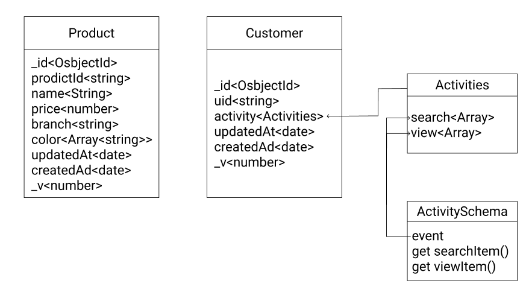

# net-challenge

## Repository

- Customer service: https://github.com/Maithanhdanh/customer_net_challenge.git
- Product service: https://github.com/Maithanhdanh/product.git
- registry service: https://github.com/Maithanhdanh/registry.git
- nginx: https://github.com/Maithanhdanh/nginx.git

## Procedure

### Start

#### Docker: *the registry service is on AWS EC2*

- in customer folder, run `./docker-build.sh`
- in product folder, run `./docker-build.sh`
- in nginx folder
  - run `./docker-build.sh`
  - run `docker-compose up --build -d`

#### Localhost: *all of services need to run on local*

- in resgistry folder, run `npm start`
- in customer folder, run `npm start`
- in product folder, run `npm start`

*Note: you must to start registry service first*
### Test

- `npm test`

*Note: in case that there is any failed suit test, please run again

## APIs

**This is list of APIs running on Postman *https://www.getpostman.com/collections/473b84d171e5f3a3a54a***

*As usual, the environment variables files (.env) will be hide. However, in this case, I add them for easier to setup to run on local*

### Customer

- Check health of all server: `GET http://localhost:5000/status`
- Check health of customer service: `GET http://localhost:5000/customer/status`
- Get customer by uid: `GET http://localhost:5000/customer/`
   - cookie `uid=1`
- Add search event into user activity: `POST http://localhost:5000/customer/add_search`
   - cookie `uid=1`
   - body `queryString` is string and not empty
- Add view event into user activity: `POST http://localhost:5000/customer/add_view`
   - cookie `uid=1`
   - body `productId` is string and not empty

### Product

- Check health of all server: `GET http://localhost:5001/status`
- Check health of product service: `GET http://localhost:5001/product/status`
- Search product: `GET http://localhost:5001/product/search`
   - there are 4 categories: `name`, `price`, `branch`, `color`
   - price must be in form `<x>-<y>`
   - example `http://localhost:5001/product/search?name=hub&price=0-1000`
- View product: `GET http://localhost:5001/product/:productId`
   - cookie `uid=1`
   - body `productId` is string and not empty
   - productId should be in [1,6] in order to get data, otherwise the returned data will be []

### Registry

- Check health of all server: `GET http://localhost:5002/status`
- Check health of registry service: `GET http://localhost:5002/registry/status`
- Check health of registry service: `POST http://localhost:5002/registry/register`
   - body `ip` must be not empty
   - body `port` must be not empty
   - body `service` must be not empty
- Check health of registry service: `POST http://localhost:5002/registry/unregister`
   - body `ip` must be not empty
   - body `port` must be not empty
   - body `service` must be not empty
- Check health of registry service: `POST http://localhost:5002/registry/get_ip`
   - body `service` must be not empty

## Infrastructure


## Workflow


## Data structure



## Development principle

I just used functional programing. Besides, the project also have CI/CD on CircleCI, then the project will be deploy on Heroku

## STRUCTURE
In this challenge, I used ExpressJS with MongoDB
### Customer

```
├── .circleci
|  └── config.yml
├── .gitignore
├── .dockerignore
├── .env
├── test.env
├── docker.env
├── package.json
├── Dockerfile
├── docker-run.sh
├── docker-build.sh
├── docker-compose.yml
├── index.js
├── config
|  ├── axiosRegistry.js
|  ├── express.js
|  ├── logger.js
|  ├── mongoose.js
|  ├── urlBase.js
|  └── vars.js
├── controllers
|  └── customer.controller.js
├── helpers
|  ├── registry.js
|  └── remoteIP.js
├── models
|  └── customer.model.js
├── response
|  └── responseReturn.js
├── routes
|  ├── customer.route.js
|  └── index.js
├── tests
|  ├── controller
|  |  └── customer.controller.test.js
|  ├── helpers
|  |  └── registry.test.js
|  └── models
|     └── customer.model.test.js
└── validation
   └── customer.validation.js
```

### Product

```
├── .circleci
|  └── config.yml
├── .gitignore
├── .dockerignore
├── .env
├── test.env
├── docker.env
├── package.json
├── Dockerfile
├── docker-run.sh
├── docker-build.sh
├── docker-compose.yml
├── index.js
├── config
|  ├── axiosCustomer.js
|  ├── axiosRegistry.js
|  ├── express.js
|  ├── logger.js
|  ├── mongoose.js
|  ├── urlBase.js
|  └── vars.js
├── controllers
|  └── product.controller.js
├── data
|  └── exampleData.js
├── helpers
|  ├── ipDiscovery.js
|  ├── registry.js
|  └── remoteIP.js
├── middlewares
|  └── customer.js
├── models
|  └── product.model.js
├── response
|  └── responseReturn.js
├── routes
|  ├── product.route.js
|  └── index.js
└── tests
   ├── controller
   |  └── product.controller.test.js
   ├── helpers
   |  └── ipDiscovery.test.js
   └── models
      └── product.model.test.js
```

### Registry

```
├── .circleci
|  └── config.yml
├── .gitignore
├── .dockerignore
├── .env
├── test.env
├── docker.env
├── package.json
├── Dockerfile
├── docker-run.sh
├── docker-build.sh
├── docker-compose.yml
├── index.js
├── config
|  ├── axiosHealth.js
|  ├── express.js
|  ├── logger.js
|  ├── mongoose.js
|  └── vars.js
├── controllers
|  └── registry.controller.js
├── models
|  └── registry.model.js
├── response
|  └── responseReturn.js
├── routes
|  ├── registry.route.js
|  └── index.js
├── tests
|  ├── controller
|  |  └── registry.controller.tes.js
|  ├── models
|  |  └── registry.model.test.js
|  └── utils
|     └── checkHealth.test.js
├── utils
|  └── checkHealth.js
└── validation
   └── registry.validation.js
```